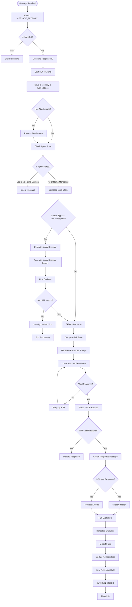

# ElizaOS Complete Documentation Extract

Extracted from docs.elizaos.ai on 2026-02-05. All 10 pages fully captured.

---

## TABLE OF CONTENTS

1. [Bootstrap Plugin Overview](#1-bootstrap-plugin-overview)
2. [Bootstrap Complete Developer Documentation](#2-bootstrap-complete-developer-documentation)
3. [Bootstrap Message Flow](#3-bootstrap-message-flow)
4. [Bootstrap Examples & Recipes](#4-bootstrap-examples--recipes)
5. [Bootstrap Testing Guide](#5-bootstrap-testing-guide)
6. [Plugin System Overview](#6-plugin-system-overview)
7. [Plugin Registry](#7-plugin-registry)
8. [Create a Plugin Guide](#8-create-a-plugin-guide)
9. [Background Tasks](#9-background-tasks)
10. [Action Planning](#10-action-planning)

---

## 1. Bootstrap Plugin Overview

**Source:** https://docs.elizaos.ai/plugin-registry/bootstrap

`@elizaos/plugin-bootstrap` is the core message handler and event system for elizaOS agents.

### Core Documentation Links

1. **Complete Developer Documentation** (`/plugin-registry/bootstrap/complete-documentation`) - Comprehensive guide covering all components, architecture, and implementation details
2. **Message Flow Diagram** (`/plugin-registry/bootstrap/message-flow`) - Step-by-step breakdown of how messages flow through the system with visual diagrams
3. **Examples & Recipes** (`/plugin-registry/bootstrap/examples`) - Practical examples, code snippets, and real-world implementations
4. **Testing Guide** (`/plugin-registry/bootstrap/testing-guide`) - Testing patterns, best practices, and comprehensive test examples

Complete documentation index available at: https://docs.elizaos.ai/llms.txt

---

## 2. Bootstrap Complete Developer Documentation

**Source:** https://docs.elizaos.ai/plugin-registry/bootstrap/complete-documentation

### Overview

The bootstrap plugin serves as the **core message handler** for elizaOS agents, enabling them to process incoming messages from various platforms (Discord, Telegram, etc.) and generate intelligent responses.

### Event Handlers

| Event Type | Handler | Purpose |
|---|---|---|
| `MESSAGE_RECEIVED` | `messageReceivedHandler` | Primary message processing |
| `VOICE_MESSAGE_RECEIVED` | `messageReceivedHandler` | Voice input handling |
| `REACTION_RECEIVED` | `reactionReceivedHandler` | Reaction storage |
| `MESSAGE_DELETED` | `messageDeletedHandler` | Deletion tracking |
| `CHANNEL_CLEARED` | `channelClearedHandler` | Channel cleanup |
| `POST_GENERATED` | `postGeneratedHandler` | Social media creation |
| `WORLD_JOINED` | `handleServerSync` | Server data synchronization |
| `ENTITY_JOINED` | `syncSingleUser` | User data synchronization |

### Actions

**Core Actions:**
- `REPLY` - Contextual responses
- `IGNORE` - Explicit non-response
- `NONE` - Placeholder / no-action

**Room Management Actions:**
- `FOLLOW_ROOM` - Follow a room
- `UNFOLLOW_ROOM` - Unfollow a room
- `MUTE_ROOM` - Mute a room
- `UNMUTE_ROOM` - Unmute a room

**Advanced Actions:**
- `SEND_MESSAGE` - Send a message to a specific target
- `UPDATE_CONTACT` - Update contact information
- `CHOOSE_OPTION` - Select from options
- `UPDATE_ROLE` - Update user roles
- `UPDATE_SETTINGS` - Modify settings
- `GENERATE_IMAGE` - Generate images

### Providers (17 total)

1. `RECENT_MESSAGES` - Conversation history
2. `TIME` - Temporal context
3. `CHARACTER` - Personality traits
4. `ENTITIES` - User information
5. `RELATIONSHIPS` - Social connections
6. `WORLD` - Environment details
7. `ANXIETY` - Anxiety/engagement level
8. `ATTACHMENTS` - Attachment data
9. `CAPABILITIES` - Agent capabilities
10. `ACTIONS` - Available actions
11. `PROVIDERS` - Available providers
12. `EVALUATORS` - Available evaluators
13. `SETTINGS` - Configuration settings
14. `ROLES` - Role information
15. `CHOICE` - Choice/option context
16. `ACTION_STATE` - Current action state
17. `FACTS` - Known facts

### Evaluators

- **REFLECTION** - Analyzes conversation quality, extracts facts, identifies relationships, and updates the knowledge base post-interaction

### Configuration Options (Environment Variables)

| Variable | Description | Default |
|---|---|---|
| `SHOULD_RESPOND_BYPASS_TYPES` | Channel types that bypass shouldRespond check | DM, VOICE_DM, SELF, API |
| `SHOULD_RESPOND_BYPASS_SOURCES` | Sources that bypass shouldRespond check | client_chat |
| `CONVERSATION_LENGTH` | Number of recent messages for context | 20 |
| `RESPONSE_TIMEOUT` | Maximum response processing time (ms) | 3600000 (1 hour) |

### Template Customization

Override default templates through character configuration:
- `shouldRespondTemplate` - Controls when agent engages
- `messageHandlerTemplate` - Controls response formulation
- `reflectionTemplate` - Controls learning and memory formation
- `postCreationTemplate` - Controls social media content

Templates use mustache-style syntax with placeholders like `{{agentName}}` and `{{providers}}`.

### Callback Mechanism

The callback function sends responses back to users:
- Calling callback delivers the message
- Multiple callbacks create multiple messages
- Omitting callback call prevents response transmission
- All handlers must await callbacks for proper error management

### TaskService

Manages both repeating and one-time scheduled operations with validation rules and worker coordination.

---

## 3. Bootstrap Message Flow

**Source:** https://docs.elizaos.ai/plugin-registry/bootstrap/message-flow

### Complete Message Flow Diagram (Mermaid)



### Step 1: Initial Message Reception

Platform-triggered event via Discord, Telegram, etc.
`EventType.MESSAGE_RECEIVED` triggers `messageReceivedHandler`

### Step 2: Self-Check

```typescript
if (message.entityId === runtime.agentId) {
  logger.debug('Skipping message from self');
  return;
}
```

### Step 3: Response ID Generation

Prevents duplicate responses during rapid message arrival:

```typescript
const responseId = v4();
latestResponseIds.get(runtime.agentId).set(message.roomId, responseId);
```

### Step 4: Run Tracking

```typescript
const runId = runtime.startRun();
await runtime.emitEvent(EventType.RUN_STARTED, {...});
```

### Step 5: Memory Storage

```typescript
await Promise.all([
  runtime.addEmbeddingToMemory(message),    // Vector embeddings
  runtime.createMemory(message, 'messages'), // Message history
]);
```

### Step 6: Attachment Processing

- Image: Generate descriptions
- Documents: Extract text
- Other: Process per configuration

```typescript
if (message.content.attachments?.length > 0) {
  message.content.attachments = await processAttachments(message.content.attachments, runtime);
}
```

### Step 7: Agent State Check

```typescript
const agentUserState = await runtime.getParticipantUserState(message.roomId, runtime.agentId);

if (
  agentUserState === 'MUTED' &&
  !message.content.text?.toLowerCase().includes(runtime.character.name.toLowerCase())
) {
  return; // Ignore if muted and not mentioned
}
```

### Step 8: Should Respond Evaluation

**Bypass Conditions:**

```typescript
function shouldBypassShouldRespond(runtime, room, source) {
  const bypassTypes = [ChannelType.DM, ChannelType.VOICE_DM, ChannelType.SELF, ChannelType.API];
  const bypassSources = ['client_chat'];
  return bypassTypes.includes(room.type) || bypassSources.includes(source);
}
```

**LLM Evaluation (when bypass does not apply):**

```typescript
if (!shouldBypassShouldRespond) {
  const state = await runtime.composeState(message, [
    'ANXIETY',
    'SHOULD_RESPOND',
    'ENTITIES',
    'CHARACTER',
    'RECENT_MESSAGES',
    'ACTIONS',
  ]);

  const prompt = composePromptFromState({
    state,
    template: shouldRespondTemplate,
  });

  const response = await runtime.useModel(ModelType.TEXT_SMALL, { prompt });
  const parsed = parseKeyValueXml(response);

  shouldRespond = parsed?.action && !['IGNORE', 'NONE'].includes(parsed.action.toUpperCase());
}
```

**Decision Tree:**

```
Is DM? --> YES --> Respond
Is Voice DM? --> YES --> Respond
Is API Call? --> YES --> Respond
Is Muted + Name Mentioned? --> YES --> Respond
Is Muted? --> NO --> Ignore
Run shouldRespond LLM -->
  - Action = REPLY/etc --> Respond
  - Action = IGNORE/NONE --> Ignore
```

### Step 9: Response Generation

**State Composition with Providers:**

```typescript
state = await runtime.composeState(message, ['ACTIONS']);

// Each provider adds context:
// - RECENT_MESSAGES: Conversation history
// - CHARACTER: Personality traits
// - ENTITIES: User information
// - TIME: Temporal context
// - RELATIONSHIPS: Social connections
// - WORLD: Environment details
// - etc.
```

**LLM Response:**

```typescript
const prompt = composePromptFromState({
  state,
  template: messageHandlerTemplate,
});

let response = await runtime.useModel(ModelType.TEXT_LARGE, { prompt });
```

**Expected XML Response Format:**

```xml
<thought>Agent's internal reasoning</thought>
<actions>REPLY,FOLLOW_ROOM</actions>
<providers>TECHNICAL_DOCS,FAQ</providers>
<text>The actual response text</text>
<simple>false</simple>
```

### Step 10: Response Validation

```typescript
while (retries < 3 && (!responseContent?.thought || !responseContent?.actions)) {
  retries++;
}

if (latestResponseIds.get(runtime.agentId).get(message.roomId) !== responseId) {
  return; // Newer message is being processed
}
```

### Step 11: Action Processing

**Simple Response (REPLY only, no additional providers):**

```typescript
if (responseContent.simple && responseContent.text) {
  await callback(responseContent);
}
```

**Complex Response:**

```typescript
await runtime.processActions(message, responseMessages, state, callback);
```

**Response Type Decision:**

```
Actions = [REPLY] only AND Providers = [] --> Simple Response
Otherwise --> Complex Response with Action Processing
```

### Step 12: Evaluator Execution

**Reflection Evaluator:**

```typescript
await runtime.evaluate(message, state, shouldRespond, callback, responseMessages);

// Reflection evaluator:
// 1. Analyzes conversation quality
// 2. Extracts new facts
// 3. Updates relationships
// 4. Self-reflects on performance
```

**Evaluator Trigger Conditions:**

```
Message Count > ConversationLength / 4 --> Run Reflection
New Interaction --> Update Relationships
Facts Mentioned --> Extract and Store
```

### Performance Optimizations

**Response ID Tracking:**
- Prevents duplicate responses when multiple messages arrive quickly
- Only processes the latest message per room

**Parallel Operations:**

```typescript
await Promise.all([
  runtime.addEmbeddingToMemory(message),
  runtime.createMemory(message, 'messages')
]);

const [entities, room, messages, interactions] = await Promise.all([
  getEntityDetails({ runtime, roomId }),
  runtime.getRoom(roomId),
  runtime.getMemories({ tableName: 'messages', roomId }),
  getRecentInteractions(...)
]);
```

**Timeout Protection:**

```typescript
const timeoutDuration = 60 * 60 * 1000; // 1 hour
await Promise.race([processingPromise, timeoutPromise]);
```

### Error Handling

**Run Lifecycle Events:**

```typescript
try {
  await runtime.emitEvent(EventType.RUN_ENDED, { status: 'completed' });
} catch (error) {
  await runtime.emitEvent(EventType.RUN_ENDED, {
    status: 'error',
    error: error.message,
  });
}
```

**Graceful Degradation:**
- Missing attachments --> Continue without them
- Provider errors --> Use default values
- LLM failures --> Retry with backoff
- Database errors --> Log and continue

### Platform-Specific Handling

**Discord:**
- Channels --> Rooms with ChannelType
- Servers --> Worlds
- Users --> Entities

**Telegram:**
- Chats --> Rooms
- Groups --> Worlds
- Users --> Entities

**Message Bus:**
- Topics --> Rooms
- Namespaces --> Worlds
- Publishers --> Entities

### Template Processing Pipeline

```
Raw Template --> Variable Injection --> Provider Data Integration -->
Final Prompt Assembly --> LLM Processing --> Response Parsing -->
Action Execution/Callback
```

**Processing Steps:**
1. Template Selection: System picks appropriate template
2. Variable Replacement: `{{agentName}}`, `{{providers}}`, etc. replaced
3. Provider Injection: Provider data formatted and inserted
4. Prompt Assembly: Complete prompt constructed
5. LLM Processing: Sent to language model
6. Response Parsing: XML/JSON response parsed
7. Execution: Actions executed, callbacks called

### Template Types and Their Impact

| Template | Used At | Controls |
|---|---|---|
| `shouldRespondTemplate` | Step 8 (Decision Point) | When agent engages, response triggers, silence periods |
| `messageHandlerTemplate` | Step 9 (Response Generation) | Response formulation, action selection, personality, provider usage |
| `reflectionTemplate` | Step 12 (Post-Interaction Analysis) | Interaction learning, fact extraction, relationship tracking, self-improvement |
| `postCreationTemplate` | POST_GENERATED event | Post style, tone, content generation, image prompt generation |

---

## 4. Bootstrap Examples & Recipes

**Source:** https://docs.elizaos.ai/plugin-registry/bootstrap/examples

### Core Architecture

The foundation requires three essential components:
1. A `Character` definition
2. The `bootstrapPlugin`
3. Appropriate model/storage providers

The minimal setup includes basic agent configuration with plugins for SQL memory, LLM integration, and bootstrap functionality.

### Custom Actions

Actions allow handlers that process user messages and execute business logic. Each action includes:
- Validation logic
- A handler function
- Example interactions
- Callback mechanism for sending multiple sequential responses

### Providers

Providers inject contextual data into the agent's decision-making process:
- Positioned at specific priority levels
- Return structured data alongside human-readable text summaries

### Evaluators

Evaluators analyze conversation patterns and trigger side effects:
- Sentiment analysis
- Escalation logic
- Validate conditions before executing
- Can modify agent behavior based on findings

### Task Services

- Scheduled execution (e.g., hourly summaries)
- Event-driven automation (e.g., welcoming new users)
- Integrate with the event system to trigger based on system conditions or entity lifecycle events

### Implementation Examples

**Support Bot:** Features ticket creation, escalation detection, and event-driven welcome messages

**Gaming Bot:** Specializes in strategy advice with game-context awareness and skill-level adaptation

**Educational Bot:** Provides adaptive learning experiences based on student proficiency

**Multi-Platform Setup:** Integrates Discord, Telegram, and Twitter simultaneously using platform adapters to normalize behavior

### Response Patterns

Actions support:
- Progressive disclosure (beginning with basics, advancing complexity)
- Error recovery with helpful guidance
- Streaming responses for real-time data delivery
- Multiple `callback` invocations enable rich multi-message exchanges

### Template Customization

Templates enable role-specific personalities:
- Gaming bots use gaming terminology and strategy focus
- Support bots emphasize issue resolution and empathy
- Educational bots adapt explanations to student proficiency levels

### Best Practices

- Always include the bootstrap plugin
- Use providers for context rather than querying databases within actions
- Configure templates to match personality
- Monitor evaluator output for continuous improvement
- Implement graceful error handling
- Test across different interaction contexts

---

## 5. Bootstrap Testing Guide

**Source:** https://docs.elizaos.ai/plugin-registry/bootstrap/testing-guide

### Test Framework

Uses **Bun's built-in test runner** (NOT Vitest). Provides Jest-compatible testing API with excellent TypeScript support and fast execution.

**Bun Test Advantages:**
1. Fast execution in Bun's native runtime
2. Built-in TypeScript without compilation
3. Jest-compatible API familiarity
4. Integrated `mock()` function
5. Snapshot testing and watch mode support

### Test Execution Commands

```bash
bun test                    # Run all tests
bun test [specific-file]    # Single file
bun test --watch            # Watch mode
bun test --coverage         # Coverage reporting
```

### Core Test Setup

```typescript
import { setupActionTest } from '@elizaos/plugin-bootstrap/test-utils';

describe('My Component', () => {
  let mockRuntime: MockRuntime;
  let mockMessage: Partial<Memory>;
  let mockState: Partial<State>;
  let callbackFn: ReturnType<typeof mock>;

  beforeEach(() => {
    const setup = setupActionTest();
    mockRuntime = setup.mockRuntime;
    mockMessage = setup.mockMessage;
    mockState = setup.mockState;
    callbackFn = setup.callbackFn;
  });
});
```

`setupActionTest()` returns:
- `mockRuntime` - Complete runtime mock with all methods
- `mockMessage` - Memory/message mock
- `mockState` - State mock
- `callbackFn` - Callback function mock

### Mock Factory Functions

```typescript
const runtime = createMockRuntime();

const message = createMockMemory({
  content: { text: 'Hello world' },
  entityId: 'user-123',
  roomId: 'room-456',
});

const state = createMockState({
  values: {
    customKey: 'customValue',
  },
});

const service = createMockService({
  serviceType: ServiceType.TASK,
});
```

### Advanced Setup with Overrides

```typescript
const setup = setupActionTest({
  messageOverrides: { /* custom message props */ },
  stateOverrides: { /* custom state */ },
  runtimeOverrides: { /* custom runtime behavior */ },
});
```

### Action Testing Pattern

```typescript
import { describe, it, expect, beforeEach, mock } from 'bun:test';
import { replyAction } from '../actions/reply';
import { setupActionTest } from '../test-utils';

describe('Reply Action', () => {
  let mockRuntime: MockRuntime;
  let mockMessage: Partial<Memory>;
  let mockState: Partial<State>;
  let callbackFn: ReturnType<typeof mock>;

  beforeEach(() => {
    const setup = setupActionTest();
    mockRuntime = setup.mockRuntime;
    mockMessage = setup.mockMessage;
    mockState = setup.mockState;
    callbackFn = setup.callbackFn;
  });

  it('should validate successfully', async () => {
    const result = await replyAction.validate(mockRuntime);
    expect(result).toBe(true);
  });

  it('should generate appropriate response', async () => {
    mockRuntime.useModel.mockResolvedValue({
      thought: 'User greeted me',
      message: 'Hello! How can I help you?',
    });

    await replyAction.handler(
      mockRuntime,
      mockMessage as Memory,
      mockState as State,
      {},
      callbackFn
    );

    expect(callbackFn).toHaveBeenCalledWith({
      thought: 'User greeted me',
      text: 'Hello! How can I help you?',
      actions: ['REPLY'],
    });
  });
});
```

### Action with Dependencies Test

```typescript
describe('Follow Room Action', () => {
  it('should update participation status', async () => {
    const setup = setupActionTest();

    setup.mockRuntime.getRoom.mockResolvedValue({
      id: 'room-123',
      type: ChannelType.TEXT,
      participants: ['user-123'],
    });

    await followRoomAction.handler(
      setup.mockRuntime,
      setup.mockMessage as Memory,
      setup.mockState as State,
      {},
      setup.callbackFn
    );

    expect(setup.mockRuntime.updateParticipantUserState).toHaveBeenCalledWith(
      'room-123',
      setup.mockRuntime.agentId,
      'FOLLOWED'
    );

    expect(setup.callbackFn).toHaveBeenCalledWith({
      text: expect.stringContaining('followed'),
      actions: ['FOLLOW_ROOM'],
    });
  });
});
```

### Provider Testing Pattern

```typescript
import { recentMessagesProvider } from '../providers/recentMessages';

describe('Recent Messages Provider', () => {
  it('should format conversation history', async () => {
    const setup = setupActionTest();

    const recentMessages = [
      createMockMemory({
        content: { text: 'Hello' },
        entityId: 'user-123',
        createdAt: Date.now() - 60000,
      }),
      createMockMemory({
        content: { text: 'Hi there!' },
        entityId: setup.mockRuntime.agentId,
        createdAt: Date.now() - 30000,
      }),
    ];

    setup.mockRuntime.getMemories.mockResolvedValue(recentMessages);
    setup.mockRuntime.getEntityById.mockResolvedValue({
      id: 'user-123',
      names: ['Alice'],
      metadata: { userName: 'alice' },
    });

    const result = await recentMessagesProvider.get(setup.mockRuntime, setup.mockMessage as Memory);

    expect(result).toHaveProperty('data');
    expect(result).toHaveProperty('values');
    expect(result).toHaveProperty('text');

    expect(result.data.recentMessages).toHaveLength(2);
    expect(result.text).toContain('Alice: Hello');
    expect(result.text).toContain('Hi there!');
  });
});
```

### Evaluator Testing Pattern

```typescript
import { reflectionEvaluator } from '../evaluators/reflection';

describe('Reflection Evaluator', () => {
  it('should extract facts from conversation', async () => {
    const setup = setupActionTest();

    setup.mockRuntime.useModel.mockResolvedValue({
      thought: 'Learned new information about user',
      facts: [
        {
          claim: 'User likes coffee',
          type: 'fact',
          in_bio: false,
          already_known: false,
        },
      ],
      relationships: [],
    });

    const result = await reflectionEvaluator.handler(
      setup.mockRuntime,
      setup.mockMessage as Memory,
      setup.mockState as State
    );

    expect(setup.mockRuntime.createMemory).toHaveBeenCalledWith(
      expect.objectContaining({
        content: { text: 'User likes coffee' },
      }),
      'facts',
      true
    );
  });
});
```

### Service Testing Pattern

```typescript
import { TaskService } from '../services/task';

describe('Task Service', () => {
  it('should execute repeating tasks', async () => {
    const setup = setupActionTest();

    const task = {
      id: 'task-123',
      name: 'TEST_TASK',
      metadata: {
        updateInterval: 1000,
        updatedAt: Date.now() - 2000,
      },
      tags: ['queue', 'repeat'],
    };

    const worker = {
      name: 'TEST_TASK',
      execute: mock(),
    };
    setup.mockRuntime.registerTaskWorker(worker);
    setup.mockRuntime.getTaskWorker.mockReturnValue(worker);
    setup.mockRuntime.getTasks.mockResolvedValue([task]);

    const service = await TaskService.start(setup.mockRuntime);

    await new Promise((resolve) => setTimeout(resolve, 1100));

    expect(worker.execute).toHaveBeenCalled();
    expect(setup.mockRuntime.updateTask).toHaveBeenCalledWith(
      'task-123',
      expect.objectContaining({
        metadata: expect.objectContaining({
          updatedAt: expect.any(Number),
        }),
      })
    );

    await service.stop();
  });
});
```

### Message Processing End-to-End Test

```typescript
import { messageReceivedHandler } from '../index';

describe('Message Processing', () => {
  it('should process message end-to-end', async () => {
    const setup = setupActionTest();
    const onComplete = mock();

    setup.mockRuntime.getRoom.mockResolvedValue({
      id: 'room-123',
      type: ChannelType.TEXT,
    });

    setup.mockRuntime.useModel
      .mockResolvedValueOnce('<action>REPLY</action>')
      .mockResolvedValueOnce({
        thought: 'Responding to greeting',
        actions: ['REPLY'],
        text: 'Hello!',
        simple: true,
      });

    await messageReceivedHandler({
      runtime: setup.mockRuntime,
      message: setup.mockMessage as Memory,
      callback: setup.callbackFn,
      onComplete,
    });

    expect(setup.mockRuntime.addEmbeddingToMemory).toHaveBeenCalled();
    expect(setup.mockRuntime.createMemory).toHaveBeenCalled();
    expect(setup.callbackFn).toHaveBeenCalledWith(
      expect.objectContaining({
        text: 'Hello!',
        actions: ['REPLY'],
      })
    );
    expect(onComplete).toHaveBeenCalled();
  });
});
```

### Edge Case Testing

```typescript
it('should handle missing attachments gracefully', async () => {
  setup.mockMessage.content.attachments = undefined;
});

it('should handle network failures', async () => {
  setup.mockRuntime.useModel.mockRejectedValue(new Error('Network error'));
});
```

### External Dependency Mocking

```typescript
import { mock } from 'bun:test';

globalThis.fetch = mock().mockResolvedValue({
  ok: true,
  arrayBuffer: () => Promise.resolve(Buffer.from('test')),
  headers: new Map([['content-type', 'image/png']]),
});
```

### Concurrent Operations Test

```typescript
it('should handle concurrent messages', async () => {
  const messages = [
    createMockMemory({ content: { text: 'Message 1' } }),
    createMockMemory({ content: { text: 'Message 2' } }),
  ];

  await Promise.all(
    messages.map((msg) =>
      messageReceivedHandler({
        runtime: setup.mockRuntime,
        message: msg,
        callback: setup.callbackFn,
      })
    )
  );

  expect(setup.callbackFn).toHaveBeenCalledTimes(2);
});
```

### State Verification Test

```typescript
it('should update agent state correctly', async () => {
  expect(setup.mockRuntime.getMemories).toHaveBeenCalledTimes(0);

  await action.handler(...);

  expect(setup.mockRuntime.createMemory).toHaveBeenCalled();
  expect(setup.mockRuntime.updateRelationship).toHaveBeenCalled();
});
```

### Room Type Handling Test

```typescript
describe('Room Type Handling', () => {
  it.each([
    [ChannelType.DM, true],
    [ChannelType.TEXT, false],
    [ChannelType.VOICE_DM, true],
  ])('should bypass shouldRespond for %s: %s', async (roomType, shouldBypass) => {
    setup.mockRuntime.getRoom.mockResolvedValue({
      id: 'room-123',
      type: roomType,
    });
  });
});
```

### Provider Context Test

```typescript
it('should include all requested providers', async () => {
  const state = await setup.mockRuntime.composeState(setup.mockMessage, [
    'RECENT_MESSAGES',
    'ENTITIES',
    'RELATIONSHIPS',
  ]);

  expect(state.providerData).toHaveLength(3);
  expect(state.providerData[0].providerName).toBe('RECENT_MESSAGES');
});
```

### Error Recovery Test

```typescript
it('should recover from provider errors', async () => {
  setup.mockRuntime.getMemories.mockRejectedValueOnce(new Error('DB error'));

  await messageReceivedHandler({...});

  expect(setup.callbackFn).toHaveBeenCalled();
});
```

### Bun Mock API Reference

```typescript
import { mock } from 'bun:test';

const mockFn = mock();

mockFn.mockReturnValue('value');
mockFn.mockResolvedValue('async value');
mockFn.mockImplementation((arg) => arg * 2);

expect(mockFn).toHaveBeenCalled();
expect(mockFn).toHaveBeenCalledWith('arg');
expect(mockFn).toHaveBeenCalledTimes(2);

mock.restore();
mockFn.mockReset();
```

---

## 6. Plugin System Overview

**Source:** https://docs.elizaos.ai/plugin-registry/overview

### Plugin Categories

**Core Plugins:**
- Bootstrap Plugin (message handling and event system)
- SQL Plugin (database integration with schema migrations)
- Knowledge Plugin (RAG system with semantic search)

**DeFi Plugins:**
- EVM Plugin (30+ networks: Ethereum, Base, Arbitrum)
- Solana Plugin (SOL/SPL transfers, Jupiter swaps)

**Platform Integrations:**
- Discord, Telegram, Twitter/X, Farcaster

**LLM Providers:**
- OpenAI, Anthropic, OpenRouter

### Plugin Interface

```typescript
export interface Plugin {
  name: string;
  description: string;
  init?: (config: Record<string, string>, runtime: IAgentRuntime) => Promise<void>;
  config?: { [key: string]: any };
  actions?: Action[];
  providers?: Provider[];
  evaluators?: Evaluator[];
  services?: (typeof Service)[];
  adapter?: IDatabaseAdapter;
  models?: { [key: string]: (...args: any[]) => Promise<any>; };
  events?: PluginEvents;
  routes?: Route[];
  tests?: TestSuite[];
  componentTypes?: { name: string; schema: Record<string, unknown>; validator?: (data: any) => boolean; }[];
  dependencies?: string[];
  testDependencies?: string[];
  priority?: number;
  schema?: any;
}
```

### Action Interface

```typescript
export interface Action {
  name: string;
  similes?: string[];
  description: string;
  examples?: ActionExample[][];
  handler: Handler;
  validate: Validator;
}

type Handler = (
  runtime: IAgentRuntime,
  message: Memory,
  state?: State,
  options?: { [key: string]: unknown },
  callback?: HandlerCallback,
  responses?: Memory[]
) => Promise<unknown>;
```

### Provider Interface

```typescript
export interface Provider {
  name: string;
  description?: string;
  dynamic?: boolean;
  position?: number;
  private?: boolean;
  get: (runtime: IAgentRuntime, message: Memory, state: State) => Promise<ProviderResult>;
}

interface ProviderResult {
  values?: { [key: string]: any };
  data?: { [key: string]: any };
  text?: string;
}
```

### Evaluator Interface

```typescript
export interface Evaluator {
  alwaysRun?: boolean;
  description: string;
  similes?: string[];
  examples: EvaluationExample[];
  handler: Handler;
  name: string;
  validate: Validator;
}
```

### Route Type

```typescript
export type Route = {
  type: 'GET' | 'POST' | 'PUT' | 'PATCH' | 'DELETE' | 'STATIC';
  path: string;
  filePath?: string;
  public?: boolean;
  name?: string;
  handler?: (req: RouteRequest, res: RouteResponse, runtime: IAgentRuntime) => Promise<void>;
  isMultipart?: boolean;
};
```

### Service Abstract Class

```typescript
export abstract class Service {
  protected runtime!: IAgentRuntime;
  constructor(runtime?: IAgentRuntime) {
    if (runtime) { this.runtime = runtime; }
  }
  abstract stop(): Promise<void>;
  static serviceType: string;
  abstract capabilityDescription: string;
  config?: Metadata;
  static async start(_runtime: IAgentRuntime): Promise<Service> {
    throw new Error('Not implemented');
  }
}
```

### Initialization Sequence

Plugins register in this order:
1. Database adapter
2. Actions
3. Evaluators
4. Providers
5. Models
6. Routes
7. Events
8. Services

The system validates plugins, prevents duplicates, and handles configuration errors gracefully.

### Event System

Standard events span:
- World events (WORLD_JOINED, etc.)
- Entity events (ENTITY_JOINED, etc.)
- Room events
- Message events (MESSAGE_RECEIVED, MESSAGE_DELETED, etc.)
- Voice events (VOICE_MESSAGE_RECEIVED)
- Run events (RUN_STARTED, RUN_ENDED)
- Action lifecycle events

Managed through a `PluginEvents` type accommodating custom handlers.

---

## 7. Plugin Registry

**Source:** https://docs.elizaos.ai/plugin-registry/registry

### Overview

The Plugin Registry is a dynamically updated collection of elizaOS-compatible plugins that automatically syncs with the official elizaOS Plugin Registry to display the latest 1.x compatible community plugins.

### Data Source

Plugins are fetched from:
```
https://raw.githubusercontent.com/elizaos-plugins/registry/refs/heads/main/generated-registry.json
```

### Plugin Card Display

Each plugin card shows:
- Display name (formatted from package name)
- Package name in monospace font
- Description
- Star count (if available)
- Version number
- Up to 3 tags (with "+X more" indicator for additional tags)

### Sorting

Plugins rank by star count descending, with alphabetical name sorting as a tiebreaker.

### Installation

Two methods:

```bash
bun install @elizaos/plugin-name
# or
elizaos plugins add @elizaos/plugin-name
```

### Registration in Character Config

```typescript
import { pluginName } from '@elizaos/plugin-name';
const character = {
  plugins: [pluginName]
};
```

### Contributing to the Registry

1. Publish to npm with `@elizaos/plugin-` prefix
2. Submit pull request to the official registry repository
3. Ensure v1.x compatibility
4. Registry updates automatically every few hours

### Important Notes

- Users should review plugin documentation and source code before installation, especially for plugins that handle sensitive operations like wallet management
- Complete documentation available at `https://docs.elizaos.ai/llms.txt`

---

## 8. Create a Plugin Guide

**Source:** https://docs.elizaos.ai/guides/create-a-plugin

### Overview

Build an AI plugin in 20 minutes. The tutorial creates a text-to-video generator using fal.ai's MiniMax Hailuo-02 model.

### Key Learning Outcomes

- **Actions** (agent capabilities)
- **Progressive development** (simple to organized)
- **Local plugin testing** (character.plugins array)
- **Component and E2E testing**

### Step 1: Quick Start

**Project Creation:**

```bash
elizaos create --type project my-eliza-project
```

Configuration: Select PgLite for database, OpenAI for model.

**Plugin Scaffold:**

```bash
elizaos create --type plugin plugin-fal-ai
```

Choose "Quick Plugin" option.

**Resulting Directory Structure:**

```
my-eliza-project/
├── src/character.ts
└── plugin-fal-ai/
    ├── src/
    │   ├── index.ts
    │   ├── plugin.ts
    │   └── __tests__/
    └── package.json
```

**Character Integration - Update `src/character.ts`:**

```typescript
export const character: Character = {
  name: 'Eliza',
  plugins: [
    '@elizaos/plugin-sql',
    '@elizaos/plugin-openai',
    '@elizaos/plugin-bootstrap',
    './plugin-fal-ai'
  ],
};
```

**Build and Verify:**

```bash
cd plugin-fal-ai && bun run build
cd .. && elizaos start
```

Confirmation appears in console logs and Plugins tab at `http://localhost:3000`.

### Step 2: Development

**Install Plugin Dependencies:**

```bash
cd plugin-fal-ai
bun add @fal-ai/client
```

**Action Implementation - `src/actions/generateVideo.ts`:**

```typescript
import {
  Action, ActionResult, IAgentRuntime, Memory, HandlerCallback, State, logger
} from '@elizaos/core';
import { fal } from '@fal-ai/client';

export const generateVideoAction: Action = {
  name: 'TEXT_TO_VIDEO',
  similes: ['CREATE_VIDEO', 'MAKE_VIDEO', 'GENERATE_VIDEO', 'VIDEO_FROM_TEXT'],
  description: 'Generate a video from text using MiniMax Hailuo-02',
  validate: async (runtime: IAgentRuntime, message: Memory) => {
    const falKey = runtime.getSetting('FAL_KEY');
    if (!falKey) {
      logger.error('FAL_KEY not found in environment variables');
      return false;
    }
    return true;
  },
  handler: async (
    runtime: IAgentRuntime,
    message: Memory,
    state: State | undefined,
    options: any,
    callback?: HandlerCallback
  ): Promise<ActionResult> => {
    try {
      fal.config({ credentials: runtime.getSetting('FAL_KEY') });
      let prompt = message.content.text.replace(/^(create video:|make video:)/i, '').trim();
      if (!prompt) return { success: false, text: 'I need a description' };

      const result = await fal.subscribe("fal-ai/minimax/hailuo-02/standard/text-to-video", {
        input: { prompt, duration: "6" },
        logs: true
      });

      const videoUrl = result.data.video.url;
      if (callback) await callback({ text: `Video ready! ${videoUrl}` });
      return { success: true, text: 'Video generated', data: { videoUrl, prompt } };
    } catch (error) {
      return { success: false, text: `Failed: ${error.message}` };
    }
  },
  examples: [
    [
      { name: '{{user}}', content: { text: 'Create video: dolphins jumping' } },
      { name: '{{agent}}', content: { text: 'Creating video!', actions: ['TEXT_TO_VIDEO'] } }
    ]
  ],
};
```

**Plugin Export - `src/index.ts`:**

```typescript
import { Plugin } from '@elizaos/core';
import { generateVideoAction } from './actions/generateVideo';

export const falaiPlugin: Plugin = {
  name: 'fal-ai',
  description: 'Generate videos using fal.ai MiniMax Hailuo-02',
  actions: [generateVideoAction],
  providers: [],
  services: []
};

export default falaiPlugin;
export { generateVideoAction };
```

**Environment Configuration - `.env`:**

```
PGLITE_DATA_DIR=./.eliza/.elizadb
OPENAI_API_KEY=your_openai_key_here
FAL_KEY=your_fal_key_here
```

### Step 3: Testing

**Functional Testing** - Rebuild and start, then test via GUI:
- "Create video: dolphins jumping in ocean"
- "Make video: cat playing piano"
- "Generate video: sunset over mountains"

**Component Test - `src/__tests__/plugin.test.ts`:**

```typescript
import { describe, it, expect } from 'bun:test';
import { falaiPlugin, generateVideoAction } from '../index';

describe('FAL AI Plugin', () => {
  it('action validates with FAL_KEY', async () => {
    const mockRuntime = {
      getSetting: (key: string) => key === 'FAL_KEY' ? 'test-key' : null
    };

    const isValid = await generateVideoAction.validate(mockRuntime as any, {} as any);
    expect(isValid).toBe(true);
  });
});
```

Run: `elizaos test --type component`

**E2E Test - `src/__tests__/e2e/plugin-fal-ai.e2e.ts`:**

```typescript
export const FalAiTestSuite = {
  name: 'fal-ai-video-generation',
  tests: [{
    name: 'should find video action in runtime',
    fn: async (runtime) => {
      const action = runtime.actions.find(a => a.name === 'TEXT_TO_VIDEO');
      if (!action) throw new Error('TEXT_TO_VIDEO action not found');
    }
  }]
};
```

Run: `elizaos test --type e2e`

### Step 4: Enhancement Suggestions

**Action improvements:**
- Add more similes
- Add more conversation examples
- Add error handling for rate limits

**Component additions:**
- Providers for video history
- Evaluators for analytics
- Services for queueing

### Related Resources

- Publish a Plugin guide
- Contribute to Core guide
- Plugin Registry
- CLI Reference

---

## 9. Background Tasks

**Source:** https://docs.elizaos.ai/guides/background-tasks

### Overview

ElizaOS provides a task worker system for handling long-running and recurring operations without blocking the main thread. Tasks are persistent, can be one-time or recurring, and are executed by registered workers.

### Task Worker Definition

Workers are registered with a unique name and execute method. They receive:
- `runtime` - The agent runtime
- `options` - Options from task metadata
- `task` - The task object itself

An optional `validate` function can pre-screen task creation.

### TaskWorker Interface

```typescript
interface TaskWorker {
  name: string;
  execute: (runtime: IAgentRuntime, options: any, task: Task) => Promise<void>;
  validate?: (runtime: IAgentRuntime, message: Memory, state: State) => Promise<boolean>;
}
```

### Task Interface

```typescript
interface Task {
  id: string;          // Auto-generated
  name: string;        // Must match a registered worker
  description: string;
  roomId?: string;     // Optional room association
  worldId?: string;    // Optional world association
  entityId?: string;   // Optional entity association
  tags: string[];      // For filtering
  metadata: {
    updateInterval?: number;  // For recurring tasks (ms)
    updatedAt?: number;       // Last execution timestamp
    [key: string]: any;       // Custom options
  };
}
```

### Task Lifecycle

Tasks progress through four states:

1. **CREATE** - Persisted to database
2. **QUEUE** - Selected by task picker based on priority/schedule
3. **EXECUTE** - Worker logic runs
4. **COMPLETE/RESCHEDULE** - One-time tasks deleted, recurring tasks await next interval

### Creating Tasks

```typescript
await runtime.createTask({
  name: 'MY_TASK_NAME',          // Must match registered worker name
  description: 'Task description',
  roomId: 'optional-room-id',
  tags: ['queue', 'repeat'],     // Tags for filtering
  metadata: {
    updateInterval: 60000,        // Recurring: every 60 seconds
    // Custom options passed to worker
    customOption: 'value',
  },
});
```

### Querying Tasks

```typescript
// Filter by room
const roomTasks = await runtime.getTasks({ roomId: 'room-123' });

// Filter by tags
const queuedTasks = await runtime.getTasks({ tags: ['queue'] });

// Filter by entity
const entityTasks = await runtime.getTasks({ entityId: 'entity-456' });

// Get by name
const namedTasks = await runtime.getTasksByName('MY_TASK_NAME');

// Get specific task
const task = await runtime.getTask('task-id-789');
```

### Updating Tasks

```typescript
await runtime.updateTask('task-id', {
  description: 'Updated description',
  metadata: {
    ...existingMetadata,
    newField: 'newValue',
  },
});
```

### Deleting Tasks

```typescript
await runtime.deleteTask('task-id');  // Stops recurring tasks permanently
```

### Registering Workers

```typescript
runtime.registerTaskWorker({
  name: 'MY_TASK_NAME',
  execute: async (runtime, options, task) => {
    // Worker logic here
    logger.info(`Executing task ${task.id}`);

    // Access custom options from metadata
    const customOption = options.customOption;

    // Do work...
  },
  validate: async (runtime, message, state) => {
    // Optional: pre-screen task creation
    return true;
  },
});
```

### Advanced Patterns

**Action-Triggered Task Scheduling:**

```typescript
// Inside an action handler:
await runtime.createTask({
  name: 'FOLLOW_UP_TASK',
  description: 'Follow up with user',
  roomId: message.roomId,
  entityId: message.entityId,
  tags: ['queue'],
  metadata: {
    updateInterval: 3600000, // 1 hour
    context: message.content.text,
  },
});
```

**Progress Tracking via Metadata:**

```typescript
runtime.registerTaskWorker({
  name: 'LONG_RUNNING_TASK',
  execute: async (runtime, options, task) => {
    const totalSteps = 10;
    for (let i = 0; i < totalSteps; i++) {
      // Do step work...

      await runtime.updateTask(task.id, {
        metadata: {
          ...task.metadata,
          progress: ((i + 1) / totalSteps) * 100,
          currentStep: i + 1,
          totalSteps,
          updatedAt: Date.now(),
        },
      });
    }
  },
});
```

**Chained Task Pipelines:**

```typescript
runtime.registerTaskWorker({
  name: 'STEP_ONE',
  execute: async (runtime, options, task) => {
    const result = await doStepOneWork();

    // Create next step in pipeline
    await runtime.createTask({
      name: 'STEP_TWO',
      description: 'Second step of pipeline',
      tags: ['queue'],
      metadata: {
        previousResult: result,
        pipelineId: options.pipelineId,
      },
    });
  },
});

runtime.registerTaskWorker({
  name: 'STEP_TWO',
  execute: async (runtime, options, task) => {
    const previousResult = options.previousResult;
    const finalResult = await doStepTwoWork(previousResult);

    // Pipeline complete
    logger.info(`Pipeline ${options.pipelineId} completed with: ${finalResult}`);
  },
});
```

**Error Handling:**

```typescript
runtime.registerTaskWorker({
  name: 'RESILIENT_TASK',
  execute: async (runtime, options, task) => {
    try {
      await doWork();
    } catch (error) {
      logger.error(`Task ${task.id} failed: ${error.message}`);

      // Store error in metadata for retry logic
      await runtime.updateTask(task.id, {
        metadata: {
          ...task.metadata,
          lastError: error.message,
          errorCount: (task.metadata.errorCount || 0) + 1,
          updatedAt: Date.now(),
        },
      });
    }
  },
});
```

### Best Practices

1. **Idempotent workers** - Design workers that handle retries safely
2. **Consistent tag naming** - Use conventions like `['queue', 'repeat']` for recurring, `['queue']` for one-time
3. **Avoid overly frequent intervals** - Don't set `updateInterval` too low
4. **Validate before creation** - Use the `validate` function to pre-screen
5. **Error handling** - Log failures and optionally update task metadata with error information

---

## 10. Action Planning

**Source:** https://docs.elizaos.ai/guides/action-planning

### Overview

ElizaOS enables agents to execute complex, sequential workflows through action chaining. Agents can orchestrate multiple actions where outputs from one step feed into the next.

### Type Definitions

**ActionPlan Interface:**

```typescript
interface ActionPlan {
  thought: string;           // LLM reasoning for this plan
  totalSteps: number;        // Total actions to execute
  currentStep: number;       // Current step (0-indexed)
  steps: ActionPlanStep[];
}
```

**ActionPlanStep Interface:**

```typescript
interface ActionPlanStep {
  action: string;
  status: 'pending' | 'completed' | 'failed';
  error?: string;
  result?: ActionResult;
}
```

**ActionResult Interface:**

```typescript
interface ActionResult {
  action: string;
  text: string;
  success: boolean;
  error?: string;
  data?: Record<string, unknown>;
}
```

### Data Flow

Results from completed actions are stored in `state.data.actionResults`, making them accessible to subsequent steps.

### Accessing Previous Results

```typescript
const myAction: Action = {
  name: 'SUMMARIZE',
  description: 'Summarize results from previous actions',
  async handler(runtime, message, state, options, callback) {
    const previousResults = state?.data?.actionResults || [];
    const searchResult = previousResults.find(r => r.action === 'SEARCH');

    if (searchResult?.text) {
      const summary = await runtime.useModel(ModelType.TEXT_SMALL, {
        prompt: `Summarize this: ${searchResult.text}`
      });
      return {
        text: summary,
        action: 'SUMMARIZE',
        success: true
      };
    }
    return {
      text: 'No previous results to summarize',
      action: 'SUMMARIZE',
      success: false
    };
  }
};
```

### Accessing Plan State

```typescript
async handler(runtime, message, state, options, callback) {
  const plan = state?.data?.actionPlan;

  if (plan) {
    console.log(`Step ${plan.currentStep + 1} of ${plan.totalSteps}`);
    console.log(`LLM reasoning: ${plan.thought}`);

    for (const step of plan.steps) {
      if (step.status === 'completed') {
        console.log(`${step.action}: ${step.result?.text}`);
      } else if (step.status === 'failed') {
        console.log(`${step.action} failed: ${step.error}`);
      }
    }
  }
}
```

### Error Handling with Fallbacks

```typescript
const resilientAction: Action = {
  name: 'PROCESS_DATA',
  async handler(runtime, message, state, options, callback) {
    const previousResults = state?.data?.actionResults || [];
    const fetchResult = previousResults.find(r => r.action === 'FETCH_DATA');

    if (fetchResult?.success === false) {
      return {
        text: 'Using cached data due to fetch failure',
        action: 'PROCESS_DATA',
        success: true,
        data: { usedFallback: true }
      };
    }

    return {
      text: `Processed: ${fetchResult?.text}`,
      action: 'PROCESS_DATA',
      success: true
    };
  }
};
```

### Retrieving Results After Execution

```typescript
const result = await runtime.handleMessage({
  entityId: userId,
  roomId: roomId,
  content: { text: 'Search and summarize AI news', source: 'api' }
});

const actionResults = runtime.getActionResults(result.messageId);

for (const result of actionResults) {
  console.log(`${result.action}: ${result.success ? 'OK' : 'FAILED'}`);
  console.log(`Output: ${result.text}`);
  if (result.data) {
    console.log(`Data:`, result.data);
  }
}
```

### Complete Data Pipeline Example

```typescript
const fetchAction: Action = {
  name: 'FETCH_DATA',
  async handler(runtime, message, state) {
    const data = await fetchFromAPI();
    return {
      text: `Fetched ${data.length} records`,
      action: 'FETCH_DATA',
      success: true,
      data: { records: data }
    };
  }
};

const transformAction: Action = {
  name: 'TRANSFORM_DATA',
  async handler(runtime, message, state) {
    const fetchResult = state?.data?.actionResults?.find(
      r => r.action === 'FETCH_DATA'
    );

    if (!fetchResult?.data?.records) {
      return { text: 'No data to transform', action: 'TRANSFORM_DATA', success: false };
    }

    const transformed = fetchResult.data.records.map(r => ({
      ...r,
      processed: true,
      timestamp: Date.now()
    }));

    return {
      text: `Transformed ${transformed.length} records`,
      action: 'TRANSFORM_DATA',
      success: true,
      data: { records: transformed }
    };
  }
};

const storeAction: Action = {
  name: 'STORE_DATA',
  async handler(runtime, message, state) {
    const transformResult = state?.data?.actionResults?.find(
      r => r.action === 'TRANSFORM_DATA'
    );

    if (!transformResult?.data?.records) {
      return { text: 'No data to store', action: 'STORE_DATA', success: false };
    }

    await database.insert(transformResult.data.records);

    return {
      text: `Stored ${transformResult.data.records.length} records`,
      action: 'STORE_DATA',
      success: true
    };
  }
};
```

### Best Practices

1. **Return structured data** - Include a `data` field for downstream consumption
2. **Be idempotent** - Actions may retry; avoid irreversible side effects
3. **Check prerequisites** - Verify required prior results exist before proceeding
4. **Fail gracefully** - Return `success: false` with clear error messages rather than throwing exceptions
5. When steps fail, execution continues by default
6. Actions should gracefully handle missing prerequisites
7. Return structured failure responses rather than throwing exceptions

---

## APPENDIX: Quick Reference

### Plugin Registration Pattern

```typescript
const myPlugin: Plugin = {
  name: 'my-plugin',
  description: 'My custom plugin',
  actions: [myAction],
  providers: [myProvider],
  evaluators: [myEvaluator],
  services: [MyService],
  events: {
    [EventType.MESSAGE_RECEIVED]: [myHandler],
  },
  routes: [myRoute],
};

export default myPlugin;
```

### Minimal Character Config

```typescript
export const character: Character = {
  name: 'MyAgent',
  plugins: [
    '@elizaos/plugin-sql',
    '@elizaos/plugin-openai',
    '@elizaos/plugin-bootstrap',
  ],
};
```

### CLI Commands

```bash
elizaos create --type project my-project     # Create project
elizaos create --type plugin plugin-name      # Create plugin
elizaos start                                  # Start agent
elizaos test --type component                  # Run component tests
elizaos test --type e2e                        # Run E2E tests
elizaos plugins add @elizaos/plugin-name       # Add plugin
bun install @elizaos/plugin-name               # Install plugin
bun test                                       # Run Bun tests
bun test --watch                               # Watch mode
bun test --coverage                            # Coverage
```

### Key Interfaces Summary

| Interface | Key Properties |
|---|---|
| `Plugin` | name, description, init?, actions?, providers?, evaluators?, services?, events?, routes? |
| `Action` | name, similes?, description, examples?, handler, validate |
| `Provider` | name, description?, dynamic?, position?, private?, get() |
| `Evaluator` | alwaysRun?, description, similes?, examples, handler, name, validate |
| `Service` | serviceType (static), start() (static), stop(), capabilityDescription |
| `Route` | type, path, handler?, public?, name? |
| `TaskWorker` | name, execute(), validate? |
| `ActionPlan` | thought, totalSteps, currentStep, steps[] |
| `ActionResult` | action, text, success, error?, data? |
